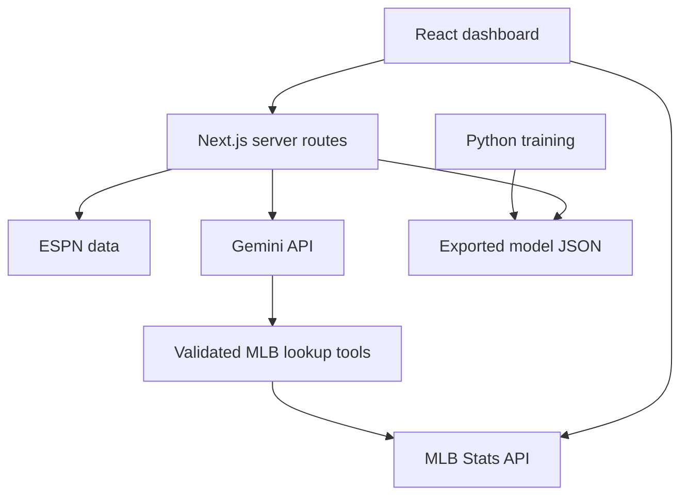

# Diamond Stats — MLB Analytics

A Next.js / React / TypeScript dashboard with MLB data, player comparisons, an optional Gemini tool-calling analyst, ESPN odds, and a Python-trained logistic-regression win model.

## Start here

Install Node.js 20.9+ (Node 22 LTS recommended). Unzip this project, open its folder in VS Code, then run:

```bash
npm ci
npm run dev
```

Open http://localhost:3000. All statistics, comparisons, standings, odds and model features work without a Gemini key when the providers are reachable. Internet access is required for MLB and ESPN data. The trained model is included; Python is not needed to run the app.

To enable AI, copy `.env.example` to `.env.local`, paste your Gemini API key into `GEMINI_API_KEY`, and restart the server. Keep the key on your computer; do not put it in chat or commit it. `GEMINI_MODEL` defaults to `gemini-2.5-flash` and can be changed to a model supported by your Google account. Gemini availability and quota depend on that account.

```bash
# macOS / Linux
cp .env.example .env.local
# Windows PowerShell instead:
# Copy-Item .env.example .env.local
```

For a production run:

```bash
npm run build
npm start
```

## What to try

- **Compare:** Search Aaron Judge in both boxes; choose 2024 for one and 2023 for the other. Each player has an independent season selector and career totals. Pick a chart metric or switch batting/pitching. Historical names such as Babe Ruth are supported through MLB search. Fuzzy suggestions use the loaded player list.
- **Players:** Search a player, open their profile, and view their available seasons, career totals and recent game log. Request AI commentary with the button.
- **Head-to-Head:** Choose a batter, pitcher and year (or career). This is direct batter-versus-pitcher history, separate from the comparison page.
- **Tonight's Games:** Select a date. Team form and season-to-date stats stop before that date. Each game shows a trained ML probability separately from available ESPN market probabilities. The model is a pregame estimate even when the game has ended.
- **MLB Odds:** ESPN scoreboard plus game-summary `pickcenter` data. Odds are refreshed every 60 seconds while the page is open. Historical odds can be pregame/closing lines. No odds are fabricated when the provider omits them. Doubleheaders are matched by team and, when needed, game time.
- **Standings:** Official MLB standings, refreshed on server requests with a five-minute cache.
- **AI Analyst:** Ask “How did Aaron Judge perform in 2024 compared with 2023?” The model can request player search, stats, schedule, standings and trained predictions. The page shows the actual tool calls. Each question is independent; this is not a persistent chat session.
- **Win Model:** View the chronological holdout evaluation and limitations.

## Actual model result

| Item | Result |
| --- | --- |
| Algorithm | StandardScaler + logistic regression |
| Training seasons | 2021–2024 |
| Training games | 9,718 unique completed regular-season games |
| Held-out season | 2025 |
| Test games | 2,430 unique completed regular-season games |
| Test accuracy | **56.21%** |
| Always pick home baseline | 54.28% |
| Brier score | 0.2438 |
| Log loss | 0.6806 |

Features are home minus away **prior-season** batting average and ERA. The intercept learns home advantage because the target is always “home team wins.” No final statistics from the target season are used as inputs. Suspended/resumed games are deduplicated by MLB game ID. Ties, non-final games and games with incomplete features are excluded.

The model was fixed before evaluating the held-out season; it has not been tuned to make that test score look better. This result does **not** support a “60%+ accuracy” claim. It is a baseline and does not account for current starting pitchers, injuries, roster changes, odds or live scores. It can produce predictions for the 2025 and 2026 game seasons using the included prior-season feature snapshots. Older in-training games are deliberately rejected. Retrain/update feature snapshots for later years.

### Reproduce training (optional)

Use Python 3.10+ in a virtual environment:

```bash
python -m venv .venv
# macOS/Linux: source .venv/bin/activate
# Windows: .venv\Scripts\Activate.ps1
python -m pip install -r ml/requirements.txt
python ml/train.py
```

The ZIP contains the raw MLB response cache used for this evaluation, so the same data can be reused. Delete `ml/cache` only if you deliberately want to download fresh historical responses. That may change results if MLB has corrected data. Cache files are excluded from Git by default.

`models/win-model.json` holds the coefficients, scaling parameters, evaluation and prior-season features. `models/evaluation.json` is the concise report; `models/test-predictions.json` contains every held-out game and its prediction. `ml/train.py` exports all three. The runtime evaluates the same formula in TypeScript; it does not start a Python server.

## Architecture



- `lib/mlb-api.ts`: MLB query helpers, career and matchup semantics, fuzzy matching.
- `lib/odds-utils.ts` and `app/api/odds/route.ts`: ESPN retrieval, schema handling and probability conversion.
- `app/api/agent/route.ts`: bounded tool-calling loop with validated arguments and a visible lookup trace.
- `lib/gemini.ts`: server-only provider call and grounding instructions.
- `ml/train.py`: data collection, chronological split, fitting and evaluation.
- `lib/prediction.ts`: server-side model loading and inference.
- `app/compare/page.tsx`: independent player/season/group filters and Recharts visualization.

No database or FastAPI service is used in this version. Runtime data comes from the APIs; training uses JSON files. See `INTERVIEW_GUIDE.md` for the explanation and `VALIDATION.md` for checks and limitations.

## Common problems

- **`npm ci` fails:** Check the Node version and that the terminal is in the folder containing `package.json`. This ZIP includes a repaired lockfile.
- **Port 3000 is in use:** `npm run dev -- --port 3001`, then open http://localhost:3001.
- **AI says key missing:** Create `.env.local` in the project root and restart Next.js. Basic features do not require AI.
- **AI quota/model error:** Check the key, Google API quota and configured model name.
- **Stats or odds unavailable:** Check internet access and retry. Some markets/older stats are genuinely absent from upstream data.
- **Model unavailable:** Confirm `models/win-model.json` exists in the extracted folder, or run the training command.

This is a local portfolio app. Public deployment would need authentication/rate limits for the AI endpoints, provider-usage review and operational monitoring. The ZIP does not publish anything or include credentials.
